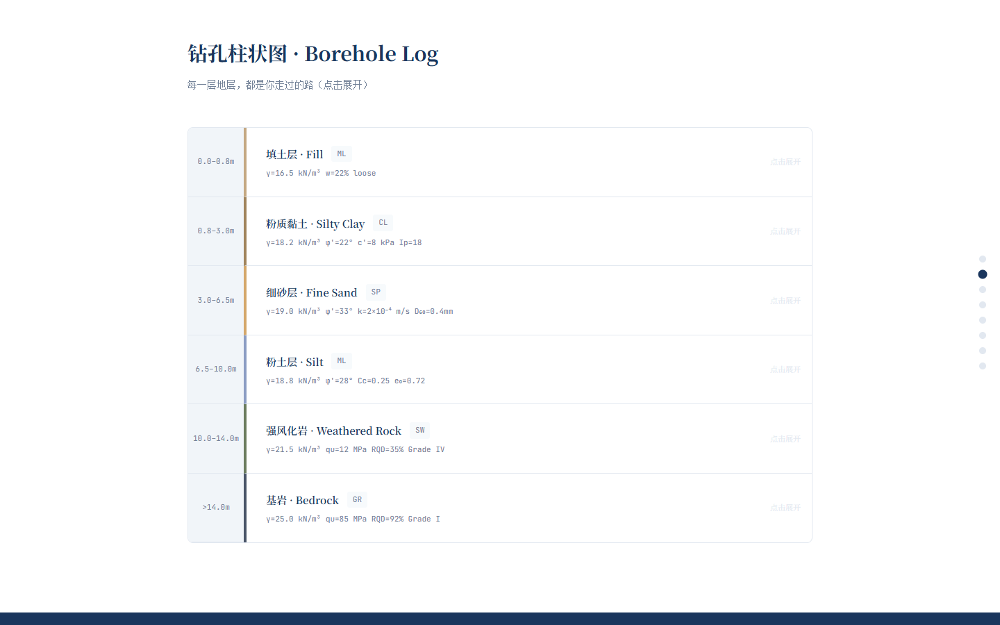
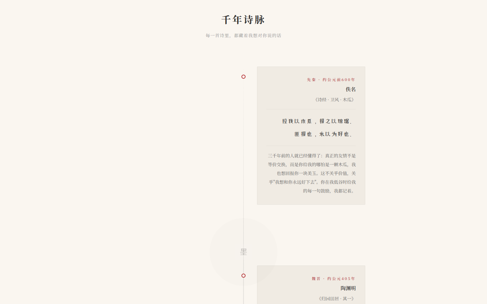

# birthday-gifts

Handcrafted birthday websites for friends — each one a unique interactive experience built as a single HTML file.

[](https://zsefgh1428688450.github.io/birthday-gifts/birthday-wensi.html)
[](LICENSE)
[]()

---

## Features

### birthday-wensi.html

A geotechnical-engineering-themed birthday site for a friend studying in the UK (Guildford to Leeds). Birthday: July 24.

- Particle explosion opening animation
- Interactive borehole log mapping geological layers to life stages
- Three.js 3D crystal specimen on dodecahedron bedrock
- SVG hand-drawn UK map with city markers
- Interactive 3D globe with NASA Blue Marble texture (city markers, arc connections, cloud layer, Fresnel atmosphere)
- Geotechnical engineering life equations
- Personal letter with engineering metaphors
- Poetry collection with flip-card effect
- Time capsule with countdown unlock

[View Live](https://zsefgh1428688450.github.io/birthday-gifts/birthday-wensi.html)

### birthday-luoyan.html

A classical Chinese poetry-themed birthday site for a friend who loves literature. Birthday: July 29.

- Chinese poetry timeline spanning 7 dynasties
- Ink wash CSS dividers
- Poetry fill-in-the-blank game
- Personal letter
- Time capsule with countdown unlock

[View Live](https://zsefgh1428688450.github.io/birthday-gifts/birthday-luoyan.html)

## Tech Stack

| Technology | Usage |
|---|---|
| Three.js r128 | 3D crystal, globe rendering |
| Canvas 2D | Particle effects, animations |
| SVG | UK map illustration |
| CSS 3D Transforms | Flip cards, layer transitions |
| GLSL Shaders | Fresnel atmosphere, crystal materials |
| IntersectionObserver | Scroll-triggered animations |
| d3-geo | Globe projections, arc paths |

## Screenshots





## Quick Start

No build tools required. Open either HTML file directly in a modern browser:

```bash
# Or serve locally with any static server
npx serve .
```

To deploy on GitHub Pages: push to a repository, then enable Pages in Settings (source: root branch).

---

## Chinese / 中文说明

为朋友手工制作的生日网页，每个页面都是一个独立的单文件 HTML 作品，打开即用。

**Wensi 的页面** — 以岩土工程为主题，为在英国留学（吉尔福德到利兹）的朋友庆生。包含粒子爆炸开场动画、交互式钻孔柱状图（地层对应人生阶段）、Three.js 3D 水晶标本、手绘英国地图、NASA 蓝色弹珠纹理的交互式 3D 地球（城市标记 + 弧线连接 + 云层 + 菲涅尔大气效果）、岩土工程人生公式、个人信件、诗歌翻页卡片以及时间胶囊。

**Luoyan 的页面** — 以中国古典诗词为主题，为热爱文学的朋友庆生。包含横跨七个朝代的诗词时间线、水墨风 CSS 分隔线、诗词填空游戏、个人信件以及时间胶囊。

### 国内访问优化

- 字体使用 `fonts.loli.net` 镜像加速 Google Fonts 加载
- Three.js 采用三级 CDN 回退策略：cdnjs -> bootcdn -> jsdelivr
- 地球纹理优先使用 jsdelivr 加载（实测 2.6s，对比 unpkg 的 16s）

## License

MIT
